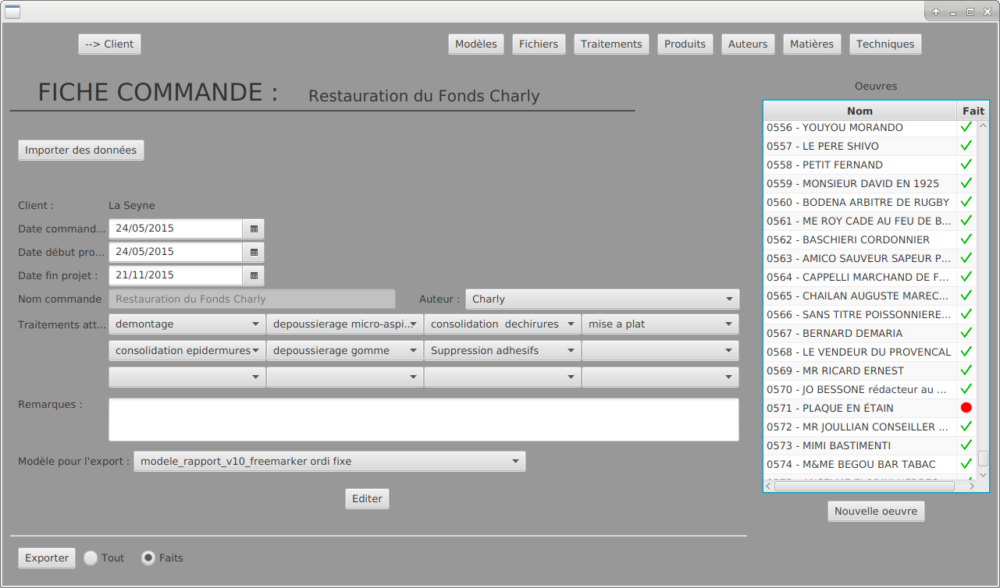
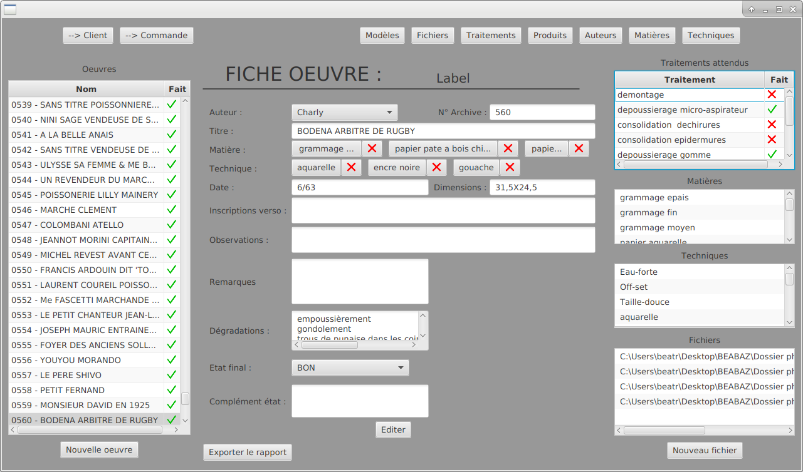
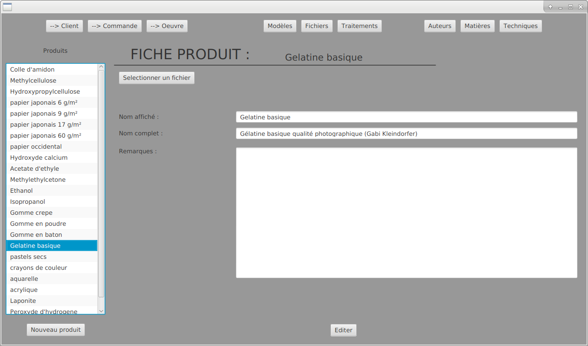

# BEABAZ_REST_CLIENT
*client JavaFX pour se connecter à BEABAZ_REST (javaFX, jackson)*

####gestion des clients et des commandes

####paramètres d'une commande

####paramètres d'une oeuvre

####paramètres d'un produit

